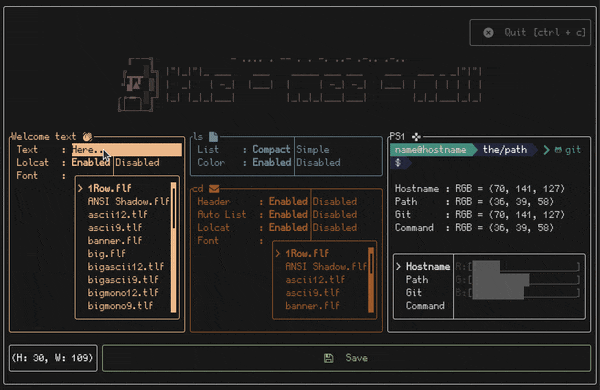

# THE-MEE-NULL 🗿


[](http://opensource.org/licenses/MIT)

Terminal Application to create outstanding terminal using [ftxui](https://github.com/ArthurSonzogni/FTXUI). 😎👍


> Shout out to [ftxui](https://github.com/ArthurSonzogni/FTXUI) for making this Terminal User Interface (TUI) app possible.


## Prerequisites ✅
1. [nerd font](https://github.com/ryanoasis/nerd-fonts.git)
1. [figlet](https://github.com/cmatsuoka/figlet)
2. [lolcat](https://github.com/busyloop/lolcat)
4. gcc
5. cmake

If you are using any debian based distros `ubuntu/pop os/..`. You can copy this
```
sudo apt install figlet lolcat gcc cmake
```


## Install 🔧
* You need to set your terminal's font into `nerdfont` since it include amazing icons.
    - If you haven't installed `nerdfont`, go check this [youtube video (3 min)](https://www.youtube.com/watch?v=cBOaYidGaCQ).
    - If you want to preview the `nerdfont` that you like, you can check [programmingfonts](https://www.programmingfonts.org/).

* After nerdfont, you can copy this command into your command line to get `the-mee-null` installed.
```
git clone https://github.com/fatinul/the-mee-null
chmod +x install.sh
sudo ./install.sh
```

* Congratulations! You can now run `the-mee-null` in your command line.

> INFO: The-mee-null only work when the height of the terminal window is at least 30 lines.


## Fonts 💬
> INFO: Figlet only support .tlf and .flf only as far as I know

* Assuming you already have figlet installed in your system, you can find a lot of `figlet fonts` at this [figlet-fonts](https://github.com/xero/figlet-fonts) github!

* After you have downloaded your favourite figlet fonts, copy the font into `/usr/bin/figlet/`

> INFO: To move the figlet font into the `/usr/bin/share/figlet` need to have `(sudo) superuser do` permission.

```
sudo mv Downloads/<font-name>.flf /usr/bin/share/figlet
```

